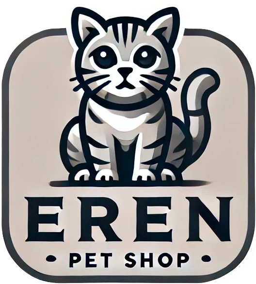

#  EREN - PetShop

## Descripción

Primer preentrega del curso de React de **Coderhouse**, "Crea tu landing". Se basa en disponer las bases para la creación de un e-commerce: **Navbar, ItemListContainer y CardWidget**. Adicionalmente se agregó un **ItemCard**. 

## Tecnologías

- React 18
- TailwindCSS
- Vite

## Instalación

- Clonar el sitio con el comando **git clone https://github.com/Jorgedc87/CreaTuLanding1Calder-n.git**
- Instalar dependencias: **npm install**
- Ejecutar la instancia de desarrollo: **npm run dev**

## Licencia y versión
- **Versión:** 1.0
- **Licencia:** Este proyecto está licenciado bajo la Licencia MIT. Consulta el archivo LICENSE para obtener más información.
- **Autor:** Jorge Calderón